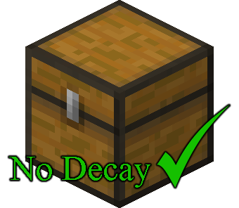

<h1> LockedChestFix</h1>
<b>Lightweight plugin designed for Minecraft Beta 1.7.3</b> 
It prevents the Locked Chest block from decaying, ensuring it won't disappear a few seconds after being placed.

---
## 🤝 Contributing
Contributions, issues, and suggestions are welcome.  
Refer to [CONTRIBUTING](https://github.com/alx-mp4/LockedChestFix?tab=contributing-ov-file) before opening pull requests.

To report bugs or request features, use the [GitHub Issues page](https://github.com/alx-mp4/LockedChestFix/issues).

---
## ⬇️ Download
The latest release is available on the [Releases page](https://github.com/alx-mp4/LockedChestFix/releases/latest).  
For extra assurance, you can verify the `.jar` file using [VirusTotal](https://www.virustotal.com/gui/home/upload).

---
**LockedChestFix** is built against [CraftBukkit 1060](https://github.com/alx-mp4/LockedChestFix/raw/refs/heads/master/libs/craftbukkit-1060.jar). It is expected to work on the server software listed below (forks of CB1060), assuming their current stable releases have not modified the APIs or behaviors used for the plugin.

- [Project Poseidon](https://github.com/retromcorg/Project-Poseidon)
- [UberBukkit](https://github.com/Moresteck/Project-Poseidon-Uberbukkit)